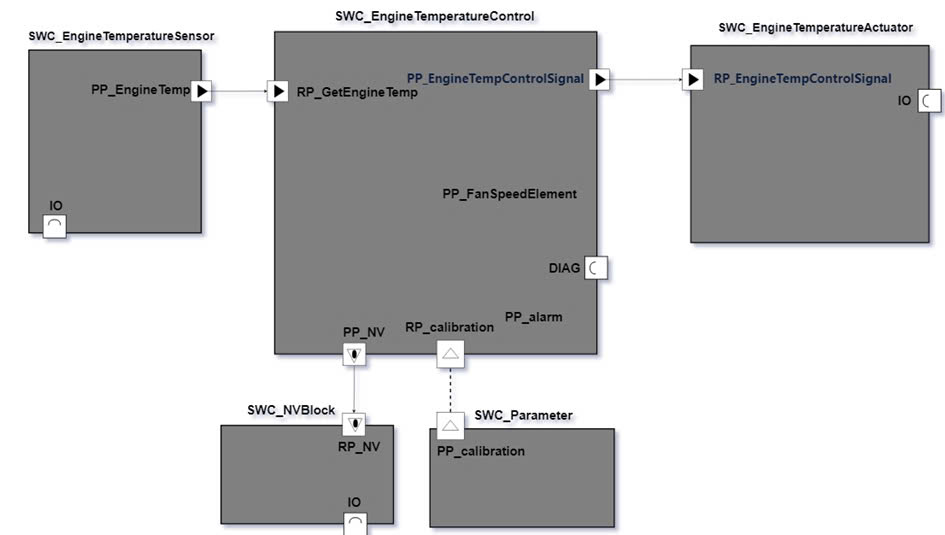
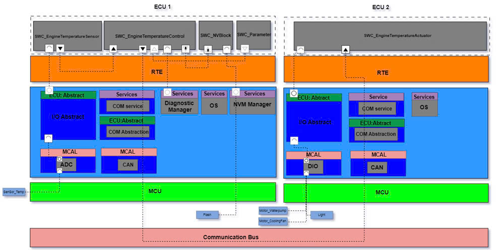

# Mock Autosar Project: Engine Cooling System

## Overview
The Engine Cooling System is designed to monitor and manage engine temperature effectively. This system utilizes ultrasonic sensors and actuators to regulate the cooling process, ensuring optimal engine performance and safety. Key functions include continuous temperature monitoring, activation of cooling fans, water pump control, overheat protection, and diagnostic error logging.

  

## Features

  

- **Temperature Monitoring**: Continuously reads engine and ambient air temperature from sensors.
- **Cooling Fan Activation**: Sends signals to activate the cooling fan when necessary.
- **Water Pump Control**: Adjusts the water pump speed based on cooling demands.
- **Overheat Protection**: Triggers emergency cooling measures when overheating is detected.
- **Diagnostic Reporting**: Detects faults in sensors and actuators, logging error codes for troubleshooting.

## Software Components (SWC)

- **EngineTemperatureSensor**: Reads engine temperature and provides data for processing.
- **EngineTemperatureControl**: Manages the cooling system based on sensor inputs, adjusts fan and pump speeds, and handles diagnostic reporting.
- **EngineTemperatureActuator**: Controls the speed of the water pump, cooling fan, and activates the warning light if the engine temperature exceeds thresholds.
- **NVBlock**: Stores and retrieves system configuration and parameters in non-volatile memory.
- **Parameter**: Provides calibration data for temperature control and system configuration.

## ECU Allocation

  

- **ECU_01**:
  - Hosts **EngineTemperatureSensor** (Runnables: `GetEngineTemperature`, `GetAirTemperature`).
  - Hosts **EngineTemperatureControl** (Runnables: `CalcCoolingSpeed`, `SendControlSignal`).
  - Hosts **NVBlock** (Runnables: `WriteErrorToNVM`, `ReadErrorToNVM`).
  - Hosts **Parameter** (Runnable: `ProvideCalibrationData`).
- **ECU_02**:
  - Hosts **EngineTemperatureActuator** (Runnables: `ChangeSpeedEnginePump`, `ChangeSpeedEngineFan`, `ChangeEngineTemperatureWarningLight`, `ReadControlSignal`).

#autosar